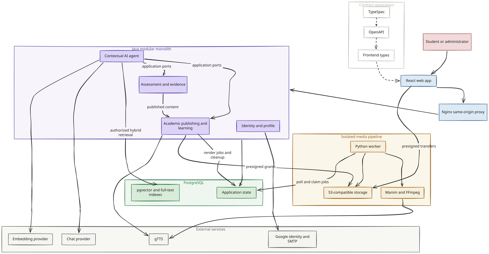

# YukCSCA

YukCSCA is a learning platform designed for Indonesian high school students preparing to study in China and take the CSCA examination. Students can review subject vocabulary before each lesson, study in their chosen explanation language, test their understanding with structured problem-solving hints, review their mistakes, and ask for contextual help grounded in reviewed course materials.

Original YukCSCA source is proprietary. See [LICENSE](LICENSE).

[Learning experience](#learning-experience) · [Authoring and publishing](#authoring-and-publishing) · [How Ask works](#how-ask-works) · [Engineering highlights](#engineering-highlights) · [Architecture](#architecture) · [Run locally](#run-locally)

## Learning experience

### Preview lesson vocabulary

Before starting a lesson, students can preview essential Chinese terms and technical phrases. Each term includes an explanation in the student's selected language. Students can listen to available pronunciations, save challenging terms to a personal vocabulary notebook, and revisit terms due for review.

[Terminology implementation](services/api/src/main/java/com/yukcsca/academic/) · [Shared terminology UI](apps/web/src/shared/terminology/)

### Study lessons in your preferred language

Students can study published lessons in Bahasa Indonesia, English, or Simplified Chinese, depending on the available authored content. Mathematics is the starting subject; Physics and Chemistry share the same learning architecture. Narrated videos offer reviewed captions in the active explanation language, timed interactive transcripts, and adjustable playback speeds. Playback positions and lesson progress are saved automatically so students can resume where they left off.

[Learning UI](apps/web/src/features/learn/)

### Check understanding with layered help

Lesson checkpoints and topic practice sets track correctness and assistance separately: completing a lesson records progress, while unassisted answers provide evidence of understanding. **Language help** offers definitions and bookmarks for supported exam-language terms without counting as a problem-solving hint. A progressive hint ladder guides students through concepts and solution steps; strong assistance, including Ask, prevents a checkpoint pass, while vocabulary lookups do not. Correct answers and unrevealed hints remain hidden until submission and review.

[Assessment implementation](services/api/src/main/java/com/yukcsca/assessment/)

### Review mistakes and try again

Incorrect answers are saved to a personal mistake notebook with their original question context. Students can add study notes, explore targeted remediation materials, and retry the problem when ready. An unassisted correct answer marks the mistake as successfully revalidated; using a problem-solving hint or Ask prevents revalidation from passing. Language help remains available without affecting the outcome.

[Assessment implementation](services/api/src/main/java/com/yukcsca/assessment/)

### Ask when you are stuck

Students can open **Ask** while studying a lesson, answering a question, reviewing a mistake, looking up a term, or working through remediation. Ask uses the active explanation language and distinguishes answers supported by reviewed materials from derived explanations and insufficient-evidence refusals. Source-backed answers include clickable citations. On active assessment items, Ask records strong assistance, which prevents a checkpoint pass or successful revalidation. The AI provides explanations; deterministic application rules grade submissions.

[Agent implementation](services/api/src/main/java/com/yukcsca/agent/) · [Ask UI](apps/web/src/features/agent/)

## Authoring and publishing

Administrators manage preparation packages, learning resources, question banks, terminology, and source provenance, publishing them as immutable revisions. New learning activity uses the active package, while assessment records retain their original question context. Lessons can use uploaded videos or Manim animations rendered by an isolated Python worker from validated scene data, with voiceover narration and timed WebVTT subtitles. Scene specifications contain no executable Python scripts, and media assets require human review before publication.

- Draft updates use optimistic concurrency checks (expected revisions); publishing validates the package as a cohesive whole.
- Media render jobs rely on PostgreSQL row locking, visibility timeouts, bounded retries, and attempt-token fencing to support safe retries and reject stale worker results.
- File uploads and streaming use presigned object storage URLs, with student access restricted to the active published release.
- A transactional outbox tracks cleanup of temporary staging files and decommissioned media objects.

[Admin UI](apps/web/src/features/academic-admin/) · [Render worker](services/render-worker/README.md)

## Sign-in and private state

YukCSCA supports Google OAuth alongside email/password registration, email verification, and password reset under a unified session model. Access tokens stay in browser memory. Refresh tokens use `HttpOnly` cookies with `Secure` enabled outside local development. Authorization checks protect student profiles, progress records, and Ask conversation histories. The security architecture features Argon2id password hashing, refresh token rotation and hashed storage with family-wide reuse detection, and single-use account recovery tokens.

[Identity implementation](services/api/src/main/java/com/yukcsca/identity/) · [Security model](docs/SECURITY.md)

## How Ask works

1. **Contextual access:** Students can open Ask from supported learning contexts (lesson, question, mistake review, vocabulary term, or remediation unit). On desktop, Ask sits in a collapsible right rail; on mobile devices, it opens in a bottom sheet so the underlying study material remains visible.
2. **Per-turn authorization:** On every interaction, the backend verifies student permissions and active package access, loading or creating an isolated conversation keyed by `(account, context type, context id)`.
3. **Bounded tool execution:** Spring AI interacts with domain services through allowlisted tools and application ports. The runtime directs the model to inspect the active learning object first and use hybrid lexical/vector search when broader course evidence is needed.
4. **Resilient retrieval:** Document indexing runs asynchronously. Query embeddings use a bounded timeout, with PostgreSQL full-text retrieval as a fallback when embeddings are unavailable or the query embedding request fails or times out.
5. **Validated structured responses:** The backend verifies citation locators against retrieved evidence before returning responses. Responses are schema-validated and classified as supported by reviewed sources, derived explanations, or insufficient-evidence refusals.
6. **Formula rendering and assistance tracking:** The frontend renders mathematical notation, scientific formulas, and interactive source chips. If an inquiry occurs during an active scored exercise, the first question logs an `AGENT_QA` assistance event for deterministic assessment rules, without duplicating the event on follow-up questions.

Chat and embedding providers can be configured independently. Automated test suites use mock adapters so CI runs never incur provider API costs.

## Engineering highlights

| Design choice                | Implementation and purpose                                                                                                                                                                                          |
| ---------------------------- | ------------------------------------------------------------------------------------------------------------------------------------------------------------------------------------------------------------------- |
| Contract-first full stack    | TypeSpec → OpenAPI 3.1 → generated TypeScript types; automated drift checks keep generated API artifacts synchronized.                                                                                              |
| Modular monolith             | Identity, profile, academic, assessment, and agent modules use application ports for cross-module access, keeping JPA entities and repositories within their owning modules.                                        |
| Grounded AI runtime          | Spring AI isolated behind domain ports, authorized retrieval pipelines, schema-validated structured answers, execution budgets, and formula rendering. Chat and embedding providers are independently configurable. |
| Retrieval resilience         | Asynchronous background indexing and query-embedding timeouts allow automatic fallback to PostgreSQL full-text search when embeddings are unavailable.                                                              |
| Durable asynchronous media   | PostgreSQL-backed job queues orchestrate the isolated rendering worker; fencing tokens reject stale job results.                                                                                                    |
| Explicit learning evidence   | Persisted attempts, hints, and assistance logs drive deterministic scoring and revalidation. LLM explanations never directly alter mastery status or grades.                                                        |
| Testable provider boundaries | Test suites use mock adapters alongside golden evaluation datasets for response classifications and refusals; integration tests run real Flyway migrations against PostgreSQL instances via Testcontainers.         |

## Tech stack

| Layer                      | Technologies                                                                                          |
| -------------------------- | ----------------------------------------------------------------------------------------------------- |
| Web                        | React 19, TypeScript 5.9, Vite 8, React Router, i18next, KaTeX, Lucide                                |
| API                        | Java 21, Spring Boot 4.1, Spring Security, Spring Data JPA                                            |
| AI and retrieval           | Spring AI 2.0.1, configurable chat/embedding adapters, PostgreSQL full-text search, pgvector          |
| Data                       | PostgreSQL 18, Flyway, JSONB published revisions                                                      |
| Media                      | Python, Manim CE, manim-voiceover, gTTS, FFmpeg/FFprobe, WebVTT, S3-compatible storage; MinIO locally |
| Contracts                  | TypeSpec 1.14, OpenAPI 3.1, openapi-typescript                                                        |
| Verification               | Vitest, Testing Library, JUnit, Testcontainers, Playwright; dedicated Python worker tests             |
| Development and operations | Node.js 24, pnpm 11.14.0, Docker Compose, Nginx, Actuator, GitHub Actions workflows                   |

## Architecture

The core platform consists of a single React web application and a modular Java API monolith. An isolated Python worker handles asynchronous media rendering, while PostgreSQL serves as the unified datastore for both relational application state and vector/full-text search indexes.



For domain ownership boundaries, state machine lifecycles, and deployment details, see [Current architecture](docs/ARCHITECTURE.md).

## Run locally

Prerequisites: Node.js 24, pnpm 11.14.0, Java 21, and Docker (with Compose 2.22 or newer).

```bash
corepack enable
corepack install --global pnpm@11.14.0
make doctor
pnpm install --frozen-lockfile
cp .env.example .env
make dev
```

Running `make dev` starts the local development environment using Docker Compose Watch. Edits to source files or configurations trigger container rebuilds; press `Ctrl+C` to stop all services. See [Development](docs/DEVELOPMENT.md) for port assignments, IDE host debugging, and local workflows.

### Configuration notes

- **Local URLs:** The web application runs at `http://localhost:5173`, with API requests proxied to `/api`.
- **Google Sign-In:** To enable real Google authentication locally, provide your Google OAuth Web Client ID in both `GOOGLE_CLIENT_ID` and `VITE_GOOGLE_CLIENT_ID`. Set `YUKCSCA_FIRST_ADMIN_EMAIL` to automatically grant administrator privileges to your pilot account upon login.
- **Ask:** AI assistance is disabled by default. Set `YUKCSCA_AGENT_ENABLED=true` and configure the chat provider in `.env`, using [`.env.example`](.env.example) as a reference. Chat and embedding providers have separate settings; provider usage may incur fees.
- **Terminology audio:** Set `YUKCSCA_SPEECH_ENABLED=true` to generate Chinese term pronunciations at package publication. The gTTS adapter does not require an API key. Video narration is handled separately by the [render worker](services/render-worker/README.md).
- **Course Content:** A fresh database starts empty without preloaded courses; packages and lessons must be authored or imported.

### Verification

```bash
make verify
pnpm e2e:web
docker compose config --quiet
```

`make verify` runs full static analysis and verification: contract drift checks, code formatting, frontend type-checking, linting, unit tests, production build, and Maven test verification against a PostgreSQL Testcontainer. Refer to the [Render Worker guide](services/render-worker/README.md) for running worker-specific Python tests.

## Explore the repository

```text
apps/web/                 React application and isolated previews
services/api/             Java modular monolith
services/render-worker/   Python media processing worker
contracts/                TypeSpec and generated OpenAPI
scripts/                  Local development and content tooling
docs/                     Requirements, delivery evidence, and engineering guides
```

[Documentation index](docs/README.md) · [Architecture](docs/ARCHITECTURE.md) · [Security](docs/SECURITY.md) · [Development](docs/DEVELOPMENT.md)

The paired [English requirements](docs/requirements/YukCSCA平台需求_EN.md) and [Chinese requirements](docs/requirements/YukCSCA平台需求_CN.md) serve as the normative product authority. When contributing, start by reviewing [AGENTS.md](AGENTS.md) and the relevant delivery brief.
