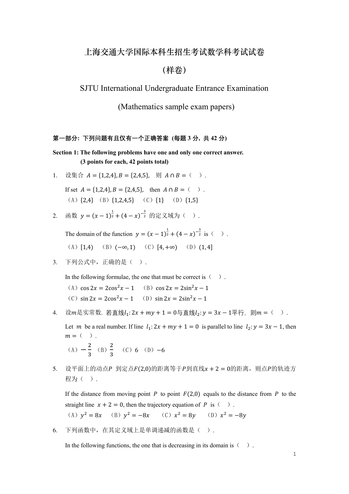
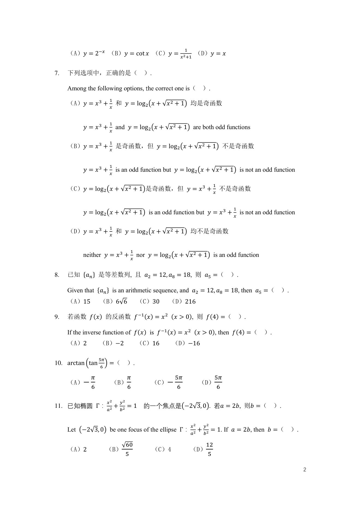
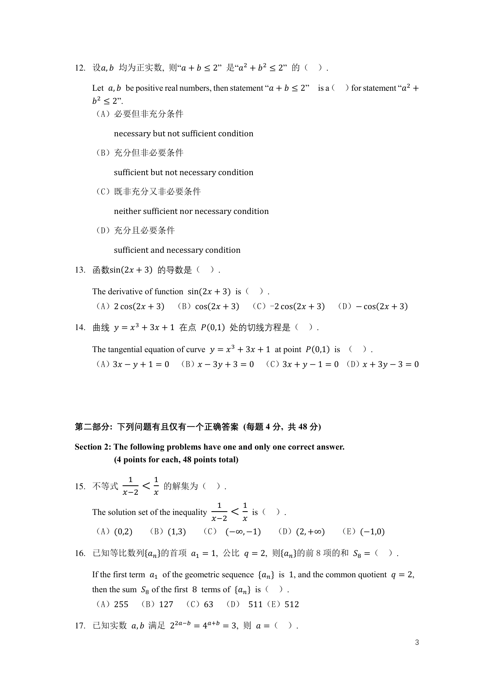
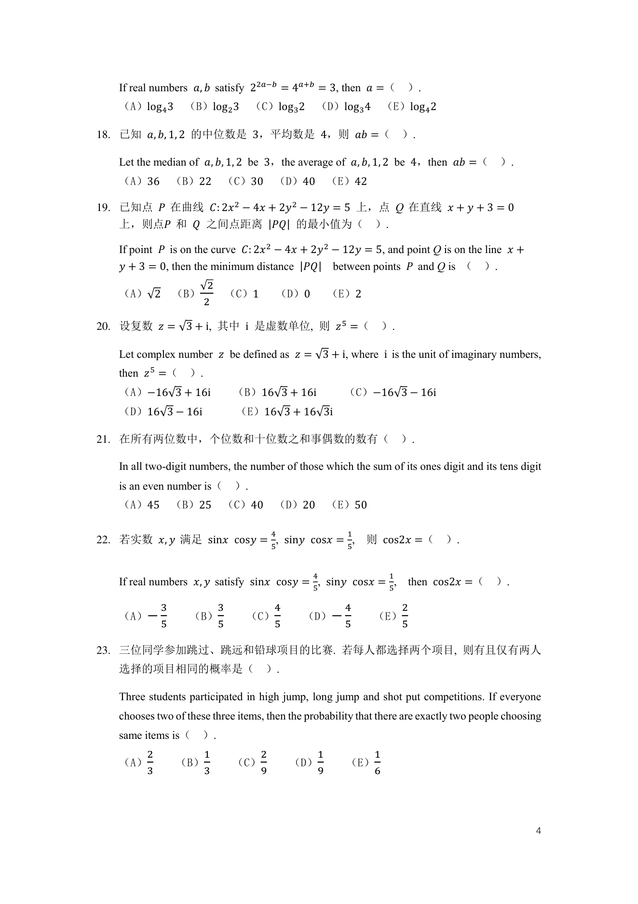
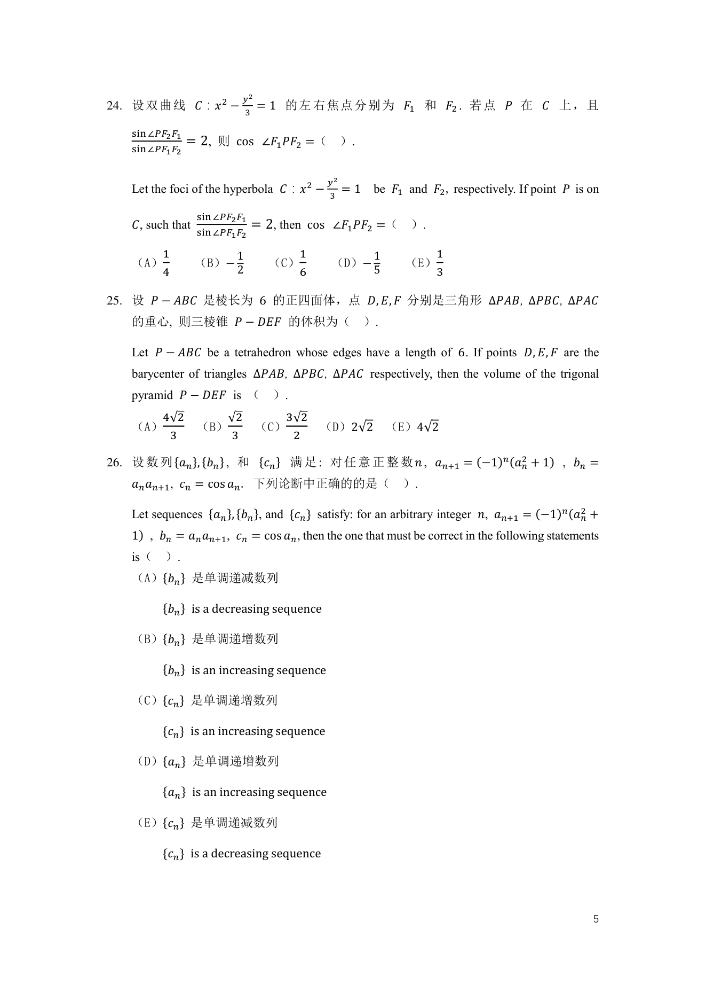
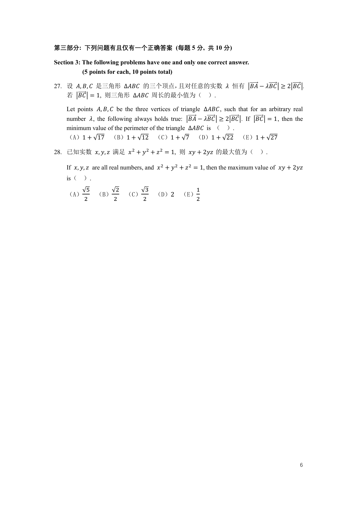
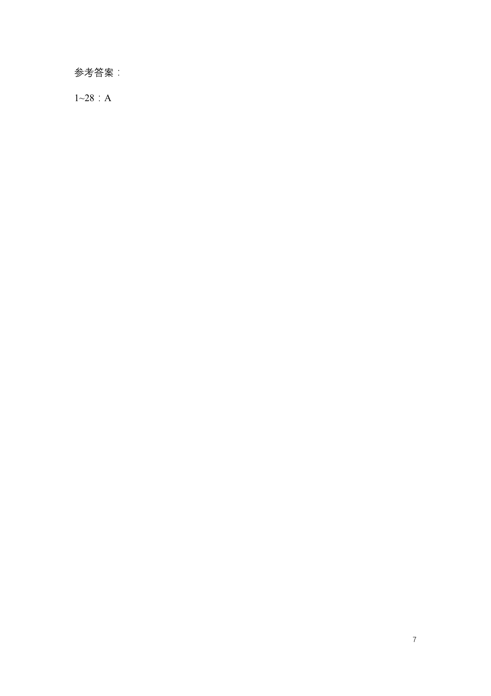

# 上海交大-数学入学考

> 转换说明：为确保原内容不丢失，每页均以原始页面图像完整保留；“可检索文本”来自 PDF 文本层，便于复制与搜索。公式、图表、插图和版式请以页面原图为准。

- 原文件：`上海交大-数学入学考.pdf`
- 页数：7

---

## 第 1 页

第 1 页可检索文本

<pre>
            上海交通大学国际本科生招生考试数学科考试试卷

                                           （样卷）

           SJTU International Undergraduate Entrance Examination

                              (Mathematics sample exam papers)

第一部分: 下列问题有且仅有一个正确答案 (每题 3 分, 共 42 分)

Section 1: The following problems have one and only one correct answer.
           (3 points for each, 42 points total)

1.   设集合 𝐴 = {1,2,4}, 𝐵 = {2,4,5}, 则 𝐴 ∩ 𝐵 =（              ）.

     If set 𝐴 = {1,2,4}, 𝐵 = {2,4,5}, then 𝐴 ∩ 𝐵 =（        ）.
     （A）{2,4} （B）{1,2,4,5} （C）{1} （D）{1,5}
                          1          3
2.   函数 𝑦 = (𝑥 − 1)2 + (4 − 𝑥)−2 的定义域为（ ）.

                                              1             3
     The domain of the function 𝑦 = (𝑥 − 1)2 + (4 − 𝑥)−2 is（        ）.

     （A）[1,4) （B）(−∞, 1) （C）[4, +∞) （D）(1, 4]

3.   下列公式中，正确的是（ ）.

     In the following formulae, the one that must be correct is（   ）.
     （A）cos 2𝑥 = 2cos2 𝑥 − 1 （B）cos 2𝑥 = 2sin2 𝑥 − 1
     （C）sin 2𝑥 = 2cos 2𝑥 − 1        （D）sin 2𝑥 = 2sin2 𝑥 − 1

4.   设𝑚是实常数. 若直线𝑙1 : 2𝑥 + 𝑚𝑦 + 1 = 0与直线𝑙2 : 𝑦 = 3𝑥 − 1平行，则𝑚 =（ ）.

     Let 𝑚 be a real number. If line 𝑙1 : 2𝑥 + 𝑚𝑦 + 1 = 0 is parallel to line 𝑙2 : 𝑦 = 3𝑥 − 1, then
     𝑚 =（ ）.
                2      2
     （A）−           （B）       （C）6 （D）−6
                3      3

5.   设平面上的动点𝑃 到定点𝐹(2,0)的距离等于𝑃到直线𝑥 + 2 = 0的距离，则点𝑃的轨迹方
     程为（ ）.

     If the distance from moving point 𝑃 to point 𝐹(2,0) equals to the distance from 𝑃 to the
     straight line 𝑥 + 2 = 0, then the trajectory equation of 𝑃 is（       ）.
            2                   2                  2                  2
     （A）𝑦 = 8𝑥        （B）𝑦 = −8𝑥           （C）𝑥 = 8𝑦            （D）𝑥 = −8𝑦

6.   下列函数中，在其定义域上是单调递减的函数是（ ）.

     In the following functions, the one that is decreasing in its domain is（   ）.
                                                                                                 1
</pre>

---

## 第 2 页

第 2 页可检索文本

<pre>
                                                      1
     （A）𝑦 = 2−𝑥 （B）𝑦 = cot 𝑥 （C）𝑦 = 𝑥 2 +1 （D）𝑦 = 𝑥

7.   下列选项中，正确的是（ ）.

     Among the following options, the correct one is（ ）.
                       1
     （A）𝑦 = 𝑥 3 +          和 𝑦 = log2 (𝑥 + √𝑥 2 + 1) 均是奇函数
                       𝑥

                       1
          𝑦 = 𝑥3 +         and 𝑦 = log2 (𝑥 + √𝑥 2 + 1) are both odd functions
                       𝑥

                       1
     （B）𝑦 = 𝑥 3 + 𝑥 是奇函数，但 𝑦 = log2 (𝑥 + √𝑥 2 + 1) 不是奇函数

                       1
          𝑦 = 𝑥 3 + 𝑥 is an odd function but 𝑦 = log2 (𝑥 + √𝑥 2 + 1) is not an odd function

                                                                     1
     （C）𝑦 = log2 (𝑥 + √𝑥 2 + 1)是奇函数，但 𝑦 = 𝑥 3 +                          不是奇函数
                                                                    𝑥

                                                                             1
          𝑦 = log2 (𝑥 + √𝑥 2 + 1) is an odd function but 𝑦 = 𝑥 3 +               is not an odd function
                                                                             𝑥

                       1
     （D）𝑦 = 𝑥 3 + 𝑥 和 𝑦 = log2 (𝑥 + √𝑥 2 + 1) 均不是奇函数

                                 1
          neither 𝑦 = 𝑥 3 + 𝑥 nor 𝑦 = log2 (𝑥 + √𝑥 2 + 1) is an odd function

8.   已知 {𝑎𝑛 } 是等差数列, 且 𝑎2 = 12, 𝑎8 = 18, 则 𝑎5 =（ ）.

     Given that {𝑎𝑛 } is an arithmetic sequence, and 𝑎2 = 12, 𝑎8 = 18, then 𝑎5 =（ ）.
     （A）15       （B）6√6              （C）30    （D）216

9.   若函数 𝑓(𝑥) 的反函数 𝑓 −1 (𝑥) = 𝑥 2 (𝑥 &gt; 0), 则 𝑓(4) =（ ）.

     If the inverse function of 𝑓(𝑥) is 𝑓 −1 (𝑥) = 𝑥 2 (𝑥 &gt; 0), then 𝑓(4) =（ ）.
     （A）2        （B）−2               （C）16      （D）−16

                 5𝜋
10. arctan (tan 6 ) =（ ）.

             𝜋                   𝜋               5𝜋                  5𝜋
     （A）−                 （B）           （C）−                   （D）
             6                   6               6                       6

                      𝑥2    𝑦2
11. 已知椭圆 Γ： 2 + 2 = 1                 的一个焦点是(−2√3, 0). 若𝑎 = 2𝑏, 则𝑏 =（                         ）.
                      𝑎     𝑏

                                                          𝑥2   𝑦2
     Let (−2√3, 0) be one focus of the ellipse Γ： 𝑎2 + 𝑏2 = 1. If 𝑎 = 2𝑏, then 𝑏 =（                  ）.

                             √60                                12
     （A）2             （B）               （C）4              （D）
                              5                                 5

                                                                                                          2
</pre>

---

## 第 3 页

第 3 页可检索文本

<pre>
12. 设𝑎, 𝑏 均为正实数, 则“𝑎 + 𝑏 ≤ 2” 是“𝑎2 + 𝑏2 ≤ 2” 的（ ）.

    Let 𝑎, 𝑏 be positive real numbers, then statement “𝑎 + 𝑏 ≤ 2” is a（ ）for statement “𝑎2 +
    𝑏2 ≤ 2”.
    （A）必要但非充分条件

          necessary but not sufficient condition

    （B）充分但非必要条件

          sufficient but not necessary condition

    （C）既非充分又非必要条件

          neither sufficient nor necessary condition

    （D）充分且必要条件

          sufficient and necessary condition

13. 函数sin(2𝑥 + 3) 的导数是（ ）.

    The derivative of function sin(2𝑥 + 3) is（          ）.
    （A）2 cos(2𝑥 + 3) （B）cos(2𝑥 + 3) （C）-2 cos(2𝑥 + 3) （D）− cos(2𝑥 + 3)

14. 曲线 𝑦 = 𝑥 3 + 3𝑥 + 1 在点 𝑃(0,1) 处的切线方程是（ ）.

    The tangential equation of curve 𝑦 = 𝑥 3 + 3𝑥 + 1 at point 𝑃(0,1) is （ ）.
    （A）3𝑥 − 𝑦 + 1 = 0 （B）𝑥 − 3𝑦 + 3 = 0 （C）3𝑥 + 𝑦 − 1 = 0 （D）𝑥 + 3𝑦 − 3 = 0

第二部分: 下列问题有且仅有一个正确答案 (每题 4 分, 共 48 分)

Section 2: The following problems have one and only one correct answer.
           (4 points for each, 48 points total)

              1        1
15. 不等式            &lt;       的解集为（ ）.
             𝑥−2       𝑥
                                          1        1
    The solution set of the inequality         &lt;       is（   ）.
                                         𝑥−2       𝑥
    （A）(0,2)       （B）(1,3)        （C） (−∞, −1)              （D）(2, +∞)   （E）(−1,0)

16. 已知等比数列{𝑎𝑛 }的首项 𝑎1 = 1, 公比 𝑞 = 2, 则{𝑎𝑛 }的前 8 项的和 𝑆8 =（ ）.

    If the first term 𝑎1 of the geometric sequence {𝑎𝑛 } is 1, and the common quotient 𝑞 = 2,
    then the sum 𝑆8 of the first 8 terms of {𝑎𝑛 } is（ ）.
    （A）255 （B）127 （C）63 （D） 511（E）512

17. 已知实数 𝑎, 𝑏 满足 22𝑎−𝑏 = 4𝑎+𝑏 = 3, 则 𝑎 =（ ）.
                                                                                                3
</pre>

---

## 第 4 页

第 4 页可检索文本

<pre>
   If real numbers 𝑎, 𝑏 satisfy 22𝑎−𝑏 = 4𝑎+𝑏 = 3, then 𝑎 =（                ）.
   （A）log4 3 （B）log2 3 （C）log3 2 （D）log3 4 （E）log4 2

18. 已知 𝑎, 𝑏, 1, 2 的中位数是 3，平均数是 4，则 𝑎𝑏 =（ ）.

   Let the median of 𝑎, 𝑏, 1, 2 be 3，the average of 𝑎, 𝑏, 1, 2 be 4，then 𝑎𝑏 =（             ）.
   （A）36 （B）22 （C）30 （D）40 （E）42

19. 已知点 𝑃 在曲线 𝐶: 2𝑥 2 − 4𝑥 + 2𝑦 2 − 12𝑦 = 5 上，点 Q 在直线 𝑥 + 𝑦 + 3 = 0
    上，则点𝑃 和 𝑄 之间点距离 |𝑃𝑄| 的最小值为（ ）.

   If point 𝑃 is on the curve 𝐶: 2𝑥 2 − 4𝑥 + 2𝑦 2 − 12𝑦 = 5, and point Q is on the line 𝑥 +
   𝑦 + 3 = 0, then the minimum distance |𝑃𝑄| between points 𝑃 and Q is （ ）.
                     √2
   （A）√2 （B）                    （C）1           （D）0       （E）2
                     2

20. 设复数 𝑧 = √3 + i, 其中 i 是虚数单位, 则 𝑧 5 =（                              ）.

   Let complex number 𝑧 be defined as 𝑧 = √3 + i, where i is the unit of imaginary numbers,
   then 𝑧 5 =（     ）.
   （A）−16√3 + 16i               （B）16√3 + 16i               （C）−16√3 − 16i
   （D）16√3 − 16i                 （E）16√3 + 16√3i

21. 在所有两位数中，个位数和十位数之和事偶数的数有（ ）.

   In all two-digit numbers, the number of those which the sum of its ones digit and its tens digit
   is an even number is（         ）.
   （A）45 （B）25 （C）40 （D）20 （E）50

                                           4                1
22. 若实数 𝑥, 𝑦 满足 sin𝑥 cos𝑦 = , sin𝑦 cos𝑥 = ,                      则 cos2𝑥 =（      ）.
                                           5                5

                                                      4                1
   If real numbers 𝑥, 𝑦 satisfy sin𝑥 cos𝑦 = 5, sin𝑦 cos𝑥 = 5,              then cos2𝑥 =（   ）.

             3              3              4                4              2
   （A）−            （B）            （C）             （D）−            （E）
             5              5              5                5              5

23. 三位同学参加跳过、跳远和铅球项目的比赛. 若每人都选择两个项目, 则有且仅有两人
   选择的项目相同的概率是（                        ）.

   Three students participated in high jump, long jump and shot put competitions. If everyone
   chooses two of these three items, then the probability that there are exactly two people choosing
   same items is（     ）.
         2              1              2              1           1
   （A）           （B）            （C）             （D）         （E）
         3              3              9              9           6

                                                                                                  4
</pre>

---

## 第 5 页

第 5 页可检索文本

<pre>
                             𝑦2
24. 设 双 曲 线 𝐶：𝑥 2 − 3 = 1 的 左 右 焦 点 分 别 为 𝐹1 和 𝐹2 . 若 点 𝑃 在 𝐶 上 ， 且

    sin ∠𝑃𝐹2 𝐹1
                  = 2, 则 cos ∠𝐹1 𝑃𝐹2 =（ ）.
    sin ∠𝑃𝐹1 𝐹2

                                             𝑦2
    Let the foci of the hyperbola 𝐶：𝑥 2 −         = 1 be 𝐹1 and 𝐹2 , respectively. If point 𝑃 is on
                                              3

                   sin ∠𝑃𝐹2 𝐹1
    𝐶, such that                 = 2, then cos ∠𝐹1 𝑃𝐹2 =（ ）.
                   sin ∠𝑃𝐹1 𝐹2

          1                1             1              1           1
    （A）            （B）−            （C）        （D）−            （E）
          4                2             6              5           3

25. 设 𝑃 − 𝐴𝐵𝐶 是棱长为 6 的正四面体，点 𝐷, 𝐸, 𝐹 分别是三角形 ∆𝑃𝐴𝐵 ∆𝑃𝐵𝐶 ∆𝑃𝐴𝐶
    的重心, 则三棱锥 𝑃 − 𝐷𝐸𝐹 的体积为（ ）.

    Let 𝑃 − 𝐴𝐵𝐶 be a tetrahedron whose edges have a length of 6. If points 𝐷, 𝐸, 𝐹 are the
    barycenter of triangles ∆𝑃𝐴𝐵 ∆𝑃𝐵𝐶 ∆𝑃𝐴𝐶 respectively, then the volume of the trigonal
    pyramid 𝑃 − 𝐷𝐸𝐹 is （            ）.
          4√2            √2           3 √2
    （A）            （B）            （C）        （D）2√2 （E）4√2
           3             3               2

26. 设 数 列 {𝑎𝑛 }, {𝑏𝑛 } , 和 {𝑐𝑛 } 满 足 : 对 任 意 正 整 数 𝑛 , 𝑎𝑛+1 = (−1)𝑛 (𝑎𝑛2 + 1) , 𝑏𝑛 =
    𝑎𝑛 𝑎𝑛+1 , 𝑐𝑛 = cos 𝑎𝑛 . 下列论断中正确的的是（ ）.

    Let sequences {𝑎𝑛 }, {𝑏𝑛 }, and {𝑐𝑛 } satisfy: for an arbitrary integer 𝑛, 𝑎𝑛+1 = (−1)𝑛 (𝑎𝑛2 +
    1) , 𝑏𝑛 = 𝑎𝑛 𝑎𝑛+1, 𝑐𝑛 = cos 𝑎𝑛 , then the one that must be correct in the following statements
    is（    ）.
    （A）{𝑏𝑛 } 是单调递减数列

          {𝑏𝑛 } is a decreasing sequence

    （B）{𝑏𝑛 } 是单调递增数列

          {𝑏𝑛 } is an increasing sequence

    （C）{𝑐𝑛 } 是单调递增数列

          {𝑐𝑛 } is an increasing sequence

    （D）{𝑎𝑛 } 是单调递增数列

          {𝑎𝑛 } is an increasing sequence

    （E）{𝑐𝑛 } 是单调递减数列

          {𝑐𝑛 } is a decreasing sequence

                                                                                                 5
</pre>

---

## 第 6 页

第 6 页可检索文本

<pre>
第三部分: 下列问题有且仅有一个正确答案 (每题 5 分, 共 10 分)

Section 3: The following problems have one and only one correct answer.
           (5 points for each, 10 points total)

                                            ⃗⃗⃗⃗⃗ − 𝜆𝐵𝐶
27. 设 𝐴, 𝐵, 𝐶 是三角形 ∆𝐴𝐵𝐶 的三个顶点，且对任意的实数 𝜆 恒有 |𝐵𝐴       ⃗⃗⃗⃗⃗ | ≥ 2|𝐵𝐶
                                                                 ⃗⃗⃗⃗⃗ |.
       ⃗⃗⃗⃗⃗
    若 |𝐵𝐶 | = 1, 则三角形 ∆𝐴𝐵𝐶 周长的最小值为（ ）.

    Let points 𝐴, 𝐵, 𝐶 be the three vertices of triangle ∆𝐴𝐵𝐶 , such that for an arbitrary real
    number 𝜆 , the following always holds true: |𝐵𝐴 ⃗⃗⃗⃗⃗ − 𝜆𝐵𝐶
                                                             ⃗⃗⃗⃗⃗ | ≥ 2|𝐵𝐶
                                                                         ⃗⃗⃗⃗⃗ | . If |𝐵𝐶
                                                                                       ⃗⃗⃗⃗⃗ | = 1 , then the
    minimum value of the perimeter of the triangle ∆𝐴𝐵𝐶 is （ ）.
    （A）1 + √17 （B）1 + √12 （C）1 + √7 （D）1 + √22 （E）1 + √27

28. 已知实数 𝑥, 𝑦, 𝑧 满足 𝑥 2 + 𝑦 2 + 𝑧 2 = 1, 则 𝑥𝑦 + 2𝑦𝑧 的最大值为（ ）.

    If 𝑥, 𝑦, 𝑧 are all real numbers, and 𝑥 2 + 𝑦 2 + 𝑧 2 = 1, then the maximum value of 𝑥𝑦 + 2𝑦𝑧
    is（    ）.
           √5           √2           √3                      1
    （A）          （B）          （C）          （D）2       （E）
           2            2            2                       2

                                                                                                           6
</pre>

---

## 第 7 页

第 7 页可检索文本

<pre>
参考答案：

1~28：A

         7
</pre>

---
