# 上海交大-物理入学考

> 转换说明：为确保原内容不丢失，每页均以原始页面图像完整保留；“可检索文本”来自 PDF 文本层，便于复制与搜索。公式、图表、插图和版式请以页面原图为准。

- 原文件：`上海交大-物理入学考.pdf`
- 页数：13

---

## 第 1 页

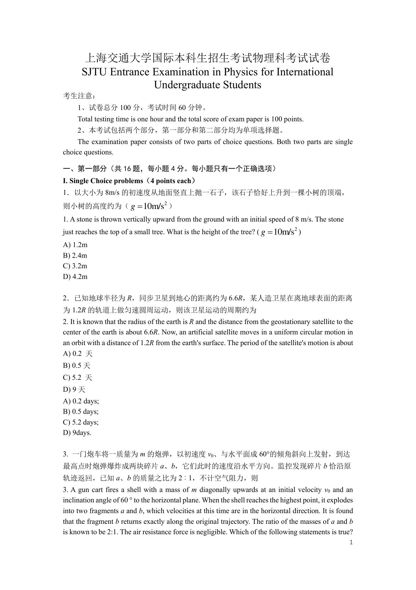

第 1 页可检索文本

<pre>
       上海交通大学国际本科生招生考试物理科考试试卷
      SJTU Entrance Examination in Physics for International
                    Undergraduate Students
考生注意：
     1、试卷总分 100 分，考试时间 60 分钟。
     Total testing time is one hour and the total score of exam paper is 100 points.
     2、本考试包括两个部分，第一部分和第二部分均为单项选择题。
     The examination paper consists of two parts of choice questions. Both two parts are single
choice questions.

一、第一部分（共 16 题，每小题 4 分。每小题只有一个正确选项）
I. Single Choice problems（4 points each）
1．以大小为 8m/s 的初速度从地面竖直上抛一石子，该石子恰好上升到一棵小树的顶端，
则小树的高度约为（ g = 10m/s2 ）
1. A stone is thrown vertically upward from the ground with an initial speed of 8 m/s. The stone
just reaches the top of a small tree. What is the height of the tree? ( g = 10m/s2 )
A) 1.2m
B) 2.4m
C) 3.2m
D) 4.2m

2．已知地球半径为 R，同步卫星到地心的距离约为 6.6R，某人造卫星在离地球表面的距离
为 1.2R 的轨道上做匀速圆周运动，则该卫星运动的周期约为
2. It is known that the radius of the earth is R and the distance from the geostationary satellite to the
center of the earth is about 6.6R. Now, an artificial satellite moves in a uniform circular motion in
an orbit with a distance of 1.2R from the earth's surface. The period of the satellite's motion is about
A) 0.2 天
B) 0.5 天
C) 5.2 天
D) 9 天
A) 0.2 days;
B) 0.5 days;
C) 5.2 days;
D) 9days.

3. 一门炮车将一质量为 m 的炮弹，以初速度 v0、与水平面成 60°的倾角斜向上发射，到达
最高点时炮弹爆炸成两块碎片 a、b，它们此时的速度沿水平方向。监控发现碎片 b 恰沿原
轨迹返回，已知 a、b 的质量之比为 2︰1，不计空气阻力，则
3. A gun cart fires a shell with a mass of m diagonally upwards at an initial velocity v0 and an
inclination angle of 60 ° to the horizontal plane. When the shell reaches the highest point, it explodes
into two fragments a and b, which velocities at this time are in the horizontal direction. It is found
that the fragment b returns exactly along the original trajectory. The ratio of the masses of a and b
is known to be 2:1. The air resistance force is negligible. Which of the following statements is true?
                                                                                                       1
</pre>

---

## 第 2 页

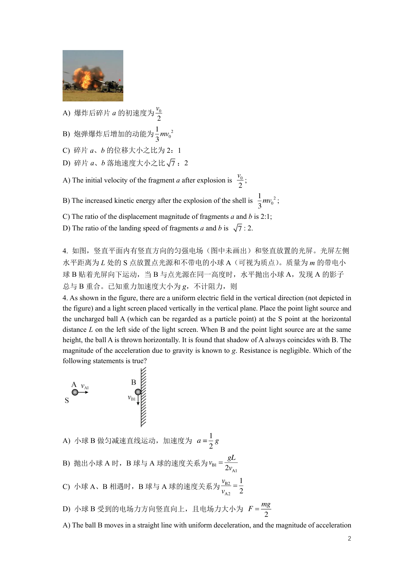

第 2 页可检索文本

<pre>
                 v
A) 爆炸后碎片 a 的初速度为 0
                 2
                 1
B) 炮弹爆炸后增加的动能为 mv02
                 3
C) 碎片 a、b 的位移大小之比为 2：1
D) 碎片 a、b 落地速度大小之比 7 ：2
                                                               v0
A) The initial velocity of the fragment a after explosion is      ;
                                                               2
                                                                  1
B) The increased kinetic energy after the explosion of the shell is mv02 ;
                                                                  3
C) The ratio of the displacement magnitude of fragments a and b is 2:1;
D) The ratio of the landing speed of fragments a and b is        7 : 2.

4. 如图，竖直平面内有竖直方向的匀强电场（图中未画出）和竖直放置的光屏。光屏左侧
水平距离为 L 处的 S 点放置点光源和不带电的小球 A（可视为质点）
                                  。质量为 m 的带电小
球 B 贴着光屏向下运动，当 B 与点光源在同一高度时，水平抛出小球 A，发现 A 的影子
总与 B 重合。已知重力加速度大小为 g，不计阻力，则
4. As shown in the figure, there are a uniform electric field in the vertical direction (not depicted in
the figure) and a light screen placed vertically in the vertical plane. Place the point light source and
the uncharged ball A (which can be regarded as a particle point) at the S point at the horizontal
distance L on the left side of the light screen. When B and the point light source are at the same
height, the ball A is thrown horizontally. It is found that shadow of A always coincides with B. The
magnitude of the acceleration due to gravity is known to g. Resistance is negligible. Which of the
following statements is true?

                                                    1
A) 小球 B 做匀减速直线运动，加速度为 a =                             g
                                                    2
                                                           gL
B) 抛出小球 A 时，B 球与 A 球的速度关系为 vB1 =
                                                          2vA1
                                                          vB2 1
C) 小球 A、B 相遇时，B 球与 A 球的速度关系为                                 =
                                                          vA2 2
                                                                    mg
D) 小球 B 受到的电场力方向竖直向上，且电场力大小为 F =
                                                                      2
A) The ball B moves in a straight line with uniform deceleration, and the magnitude of acceleration
                                                                                                      2
</pre>

---

## 第 3 页

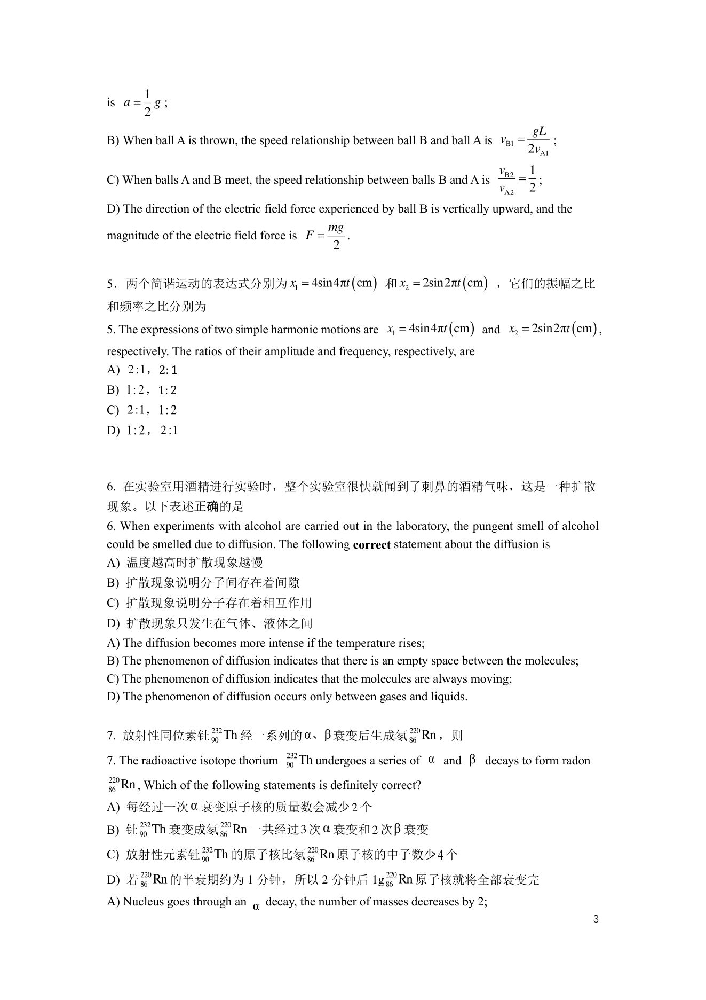

第 3 页可检索文本

<pre>
          1
is a =      g;
          2
                                                                                       gL
B) When ball A is thrown, the speed relationship between ball B and ball A is vB1 =        ;
                                                                                      2vA1
                                                                                vB2 1
C) When balls A and B meet, the speed relationship between balls B and A is        = ;
                                                                                vA2 2
D) The direction of the electric field force experienced by ball B is vertically upward, and the
                                               mg
magnitude of the electric field force is F =      .
                                                2

5．两个简谐运动的表达式分别为 x1 = 4sin4πt ( cm ) 和 x2 = 2sin2πt ( cm ) ，它们的振幅之比
和频率之比分别为
5. The expressions of two simple harmonic motions are x1 = 4sin4πt ( cm ) and x2 = 2sin2πt ( cm ) ,
respectively. The ratios of their amplitude and frequency, respectively, are
A) 2 :1，2: 1
B) 1: 2 ，1: 2
C) 2 :1， 1: 2
D) 1: 2 ， 2 :1

6. 在实验室用酒精进行实验时，整个实验室很快就闻到了刺鼻的酒精气味，这是一种扩散
现象。以下表述正确的是
6. When experiments with alcohol are carried out in the laboratory, the pungent smell of alcohol
could be smelled due to diffusion. The following correct statement about the diffusion is
A) 温度越高时扩散现象越慢
B) 扩散现象说明分子间存在着间隙
C) 扩散现象说明分子存在着相互作用
D) 扩散现象只发生在气体、液体之间
A) The diffusion becomes more intense if the temperature rises;
B) The phenomenon of diffusion indicates that there is an empty space between the molecules;
C) The phenomenon of diffusion indicates that the molecules are always moving;
D) The phenomenon of diffusion occurs only between gases and liquids.

7. 放射性同位素钍 90 Th 经一系列的 α、β 衰变后生成氡 86 Rn ，则
                        232                                      220

7. The radioactive isotope thorium 90 Th undergoes a series of α and β decays to form radon
                                       232

220
86    Rn , Which of the following statements is definitely correct?
A) 每经过一次 α 衰变原子核的质量数会减少 2 个
B) 钍 90 Th 衰变成氡 86 Rn 一共经过 3 次 α 衰变和 2 次 β 衰变
         232                220

                      232                    220
C) 放射性元素钍 90 Th 的原子核比氡 86 Rn 原子核的中子数少 4 个
          220                                              220
D) 若 86 Rn 的半衰期约为 1 分钟，所以 2 分钟后 1g 86 Rn 原子核就将全部衰变完
A) Nucleus goes through an α decay, the number of masses decreases by 2;
                                                                                                   3
</pre>

---

## 第 4 页

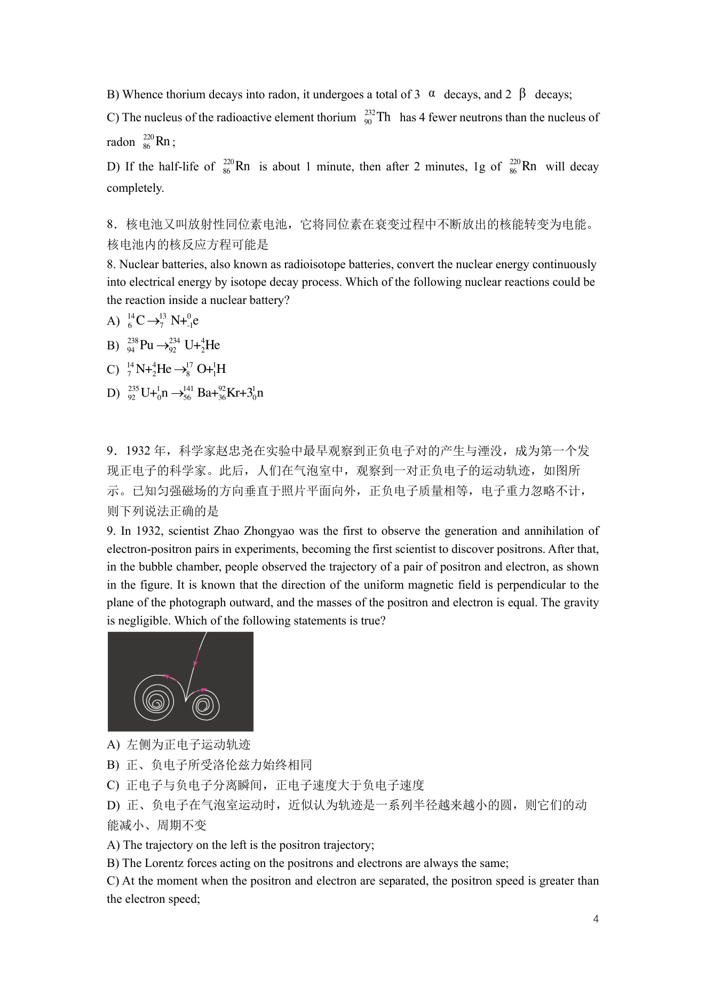

第 4 页可检索文本

<pre>
B) Whence thorium decays into radon, it undergoes a total of 3 α decays, and 2 β decays;
                                                  232
C) The nucleus of the radioactive element thorium 90  Th has 4 fewer neutrons than the nucleus of
      220
radon 86  Rn ;
                       220                                                   220
D) If the half-life of 86  Rn is about 1 minute, then after 2 minutes, 1g of 86  Rn will decay
completely.

8．核电池又叫放射性同位素电池，它将同位素在衰变过程中不断放出的核能转变为电能。
核电池内的核反应方程可能是
8. Nuclear batteries, also known as radioisotope batteries, convert the nuclear energy continuously
into electrical energy by isotope decay process. Which of the following nuclear reactions could be
the reaction inside a nuclear battery?
   6 C →7 N+-1e
A) 14   13  0

   238
B) 94  Pu →92
           234
               U+42He

   7 N+2 He →8 O+1H
C) 14  4     17  1

   235
D) 92  U+10n →141   92     1
              56 Ba+36 Kr+30 n

9．1932 年，科学家赵忠尧在实验中最早观察到正负电子对的产生与湮没，成为第一个发
现正电子的科学家。此后，人们在气泡室中，观察到一对正负电子的运动轨迹，如图所
示。已知匀强磁场的方向垂直于照片平面向外，正负电子质量相等，电子重力忽略不计，
则下列说法正确的是
9. In 1932, scientist Zhao Zhongyao was the first to observe the generation and annihilation of
electron-positron pairs in experiments, becoming the first scientist to discover positrons. After that,
in the bubble chamber, people observed the trajectory of a pair of positron and electron, as shown
in the figure. It is known that the direction of the uniform magnetic field is perpendicular to the
plane of the photograph outward, and the masses of the positron and electron is equal. The gravity
is negligible. Which of the following statements is true?

A) 左侧为正电子运动轨迹
B) 正、负电子所受洛伦兹力始终相同
C) 正电子与负电子分离瞬间，正电子速度大于负电子速度
D) 正、负电子在气泡室运动时，近似认为轨迹是一系列半径越来越小的圆，则它们的动
能减小、周期不变
A) The trajectory on the left is the positron trajectory;
B) The Lorentz forces acting on the positrons and electrons are always the same;
C) At the moment when the positron and electron are separated, the positron speed is greater than
the electron speed;
                                                                                                     4
</pre>

---

## 第 5 页

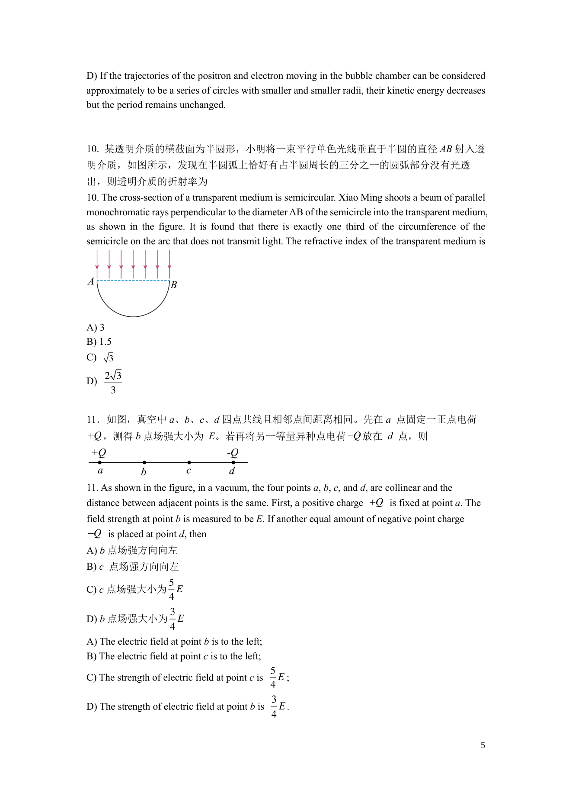

第 5 页可检索文本

<pre>
D) If the trajectories of the positron and electron moving in the bubble chamber can be considered
approximately to be a series of circles with smaller and smaller radii, their kinetic energy decreases
but the period remains unchanged.

10. 某透明介质的横截面为半圆形，小明将一束平行单色光线垂直于半圆的直径 AB 射入透
明介质，如图所示，发现在半圆弧上恰好有占半圆周长的三分之一的圆弧部分没有光透
出，则透明介质的折射率为
10. The cross-section of a transparent medium is semicircular. Xiao Ming shoots a beam of parallel
monochromatic rays perpendicular to the diameter AB of the semicircle into the transparent medium,
as shown in the figure. It is found that there is exactly one third of the circumference of the
semicircle on the arc that does not transmit light. The refractive index of the transparent medium is

A) 3
B) 1.5
C)    3
     2 3
D)
      3

11．如图，真空中 a、b、c、d 四点共线且相邻点间距离相同。先在 a 点固定一正点电荷
+Q ，测得 b 点场强大小为 E。若再将另一等量异种点电荷 −Q 放在 d 点，则

11. As shown in the figure, in a vacuum, the four points a, b, c, and d, are collinear and the
distance between adjacent points is the same. First, a positive charge +Q is fixed at point a. The
field strength at point b is measured to be E. If another equal amount of negative point charge
−Q is placed at point d, then
A) b 点场强方向向左
B) c 点场强方向向左
           5
C) c 点场强大小为 E
           4
                      3
D) b 点场强大小为 E
                      4
A) The electric field at point b is to the left;
B) The electric field at point c is to the left;
                                               5
C) The strength of electric field at point c is   E;
                                               4
                                                3
D) The strength of electric field at point b is E .
                                                4

                                                                                                    5
</pre>

---

## 第 6 页

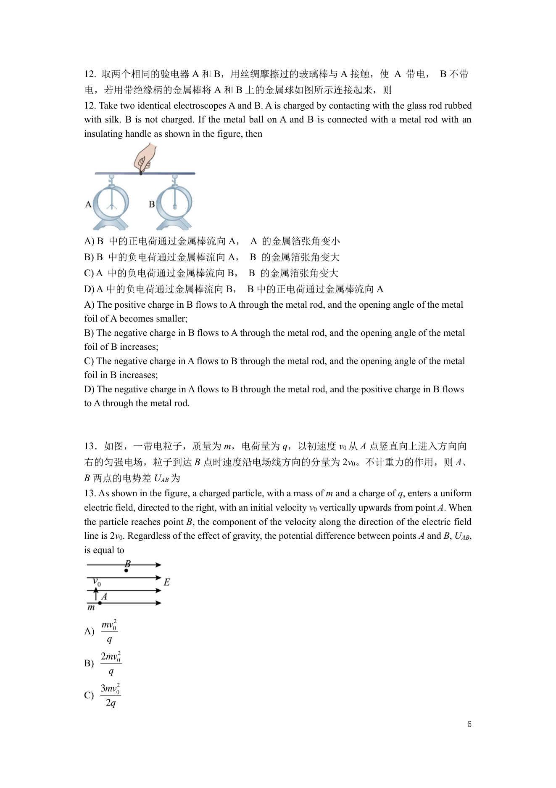

第 6 页可检索文本

<pre>
12. 取两个相同的验电器 A 和 B，用丝绸摩擦过的玻璃棒与 A 接触，使 A 带电， B 不带
电，若用带绝缘柄的金属棒将 A 和 B 上的金属球如图所示连接起来，则
12. Take two identical electroscopes A and B. A is charged by contacting with the glass rod rubbed
with silk. B is not charged. If the metal ball on A and B is connected with a metal rod with an
insulating handle as shown in the figure, then

A) B 中的正电荷通过金属棒流向 A， A 的金属箔张角变小
B) B 中的负电荷通过金属棒流向 A， B 的金属箔张角变大
C) A 中的负电荷通过金属棒流向 B， B 的金属箔张角变大
D) A 中的负电荷通过金属棒流向 B， B 中的正电荷通过金属棒流向 A
A) The positive charge in B flows to A through the metal rod, and the opening angle of the metal
foil of A becomes smaller;
B) The negative charge in B flows to A through the metal rod, and the opening angle of the metal
foil of B increases;
C) The negative charge in A flows to B through the metal rod, and the opening angle of the metal
foil in B increases;
D) The negative charge in A flows to B through the metal rod, and the positive charge in B flows
to A through the metal rod.

13．如图，一带电粒子，质量为 m，电荷量为 q，以初速度 v0 从 A 点竖直向上进入方向向
右的匀强电场，粒子到达 B 点时速度沿电场线方向的分量为 2v0。不计重力的作用，则 A、
B 两点的电势差 UAB 为
13. As shown in the figure, a charged particle, with a mass of m and a charge of q, enters a uniform
electric field, directed to the right, with an initial velocity v0 vertically upwards from point A. When
the particle reaches point B, the component of the velocity along the direction of the electric field
line is 2v0. Regardless of the effect of gravity, the potential difference between points A and B, UAB,
is equal to

     mv02
A)
      q
     2mv02
B)
      q
     3mv02
C)
      2q

                                                                                                      6
</pre>

---

## 第 7 页

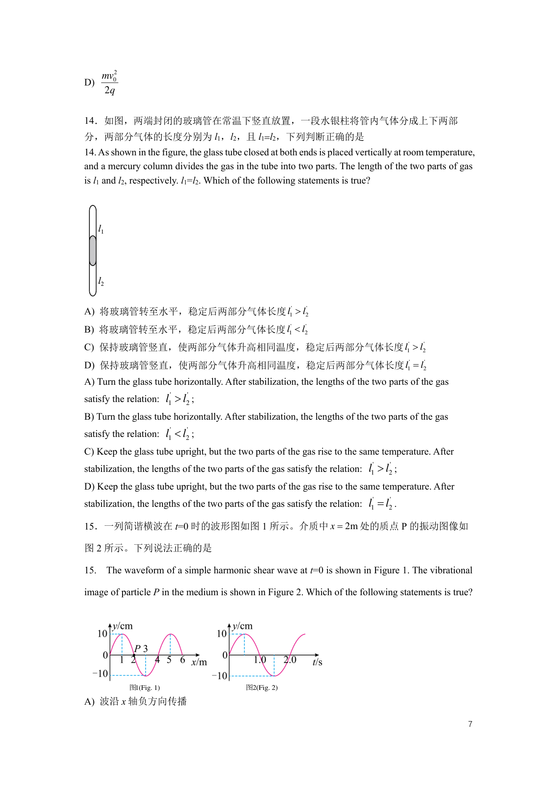

第 7 页可检索文本

<pre>
     mv02
D)
     2q

14．如图，两端封闭的玻璃管在常温下竖直放置，一段水银柱将管内气体分成上下两部
分，两部分气体的长度分别为 l1，l2，且 l1=l2，下列判断正确的是
14. As shown in the figure, the glass tube closed at both ends is placed vertically at room temperature,
and a mercury column divides the gas in the tube into two parts. The length of the two parts of gas
is l1 and l2, respectively. l1=l2. Which of the following statements is true?

A) 将玻璃管转至水平，稳定后两部分气体长度 l1'  l2'
B) 将玻璃管转至水平，稳定后两部分气体长度 l1'  l2'
C) 保持玻璃管竖直，使两部分气体升高相同温度，稳定后两部分气体长度 l1'  l2'
D) 保持玻璃管竖直，使两部分气体升高相同温度，稳定后两部分气体长度 l1' = l2'
A) Turn the glass tube horizontally. After stabilization, the lengths of the two parts of the gas
satisfy the relation: l1  l2 ;
                         '   '

B) Turn the glass tube horizontally. After stabilization, the lengths of the two parts of the gas
satisfy the relation: l1  l2 ;
                         '   '

C) Keep the glass tube upright, but the two parts of the gas rise to the same temperature. After
stabilization, the lengths of the two parts of the gas satisfy the relation: l1  l2 ;
                                                                               '    '

D) Keep the glass tube upright, but the two parts of the gas rise to the same temperature. After
stabilization, the lengths of the two parts of the gas satisfy the relation: l1 = l2 .
                                                                               '    '

15．一列简谐横波在 t=0 时的波形图如图 1 所示。介质中 x = 2m 处的质点 P 的振动图像如

图 2 所示。下列说法正确的是

15. The waveform of a simple harmonic shear wave at t=0 is shown in Figure 1. The vibrational

image of particle P in the medium is shown in Figure 2. Which of the following statements is true?

            图1(Fig. 1)                      图2(Fig. 2)

A) 波沿 x 轴负方向传播

                                                                                                      7
</pre>

---

## 第 8 页

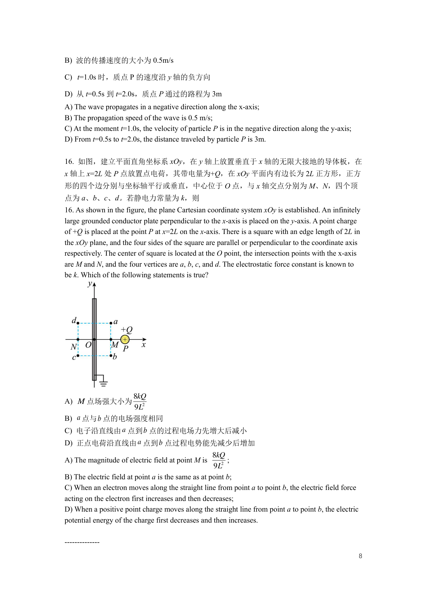

第 8 页可检索文本

<pre>
B) 波的传播速度的大小为 0.5m/s

C) t=1.0s 时，质点 P 的速度沿 y 轴的负方向

D) 从 t=0.5s 到 t=2.0s，质点 P 通过的路程为 3m
A) The wave propagates in a negative direction along the x-axis;
B) The propagation speed of the wave is 0.5 m/s;
C) At the moment t=1.0s, the velocity of particle P is in the negative direction along the y-axis;
D) From t=0.5s to t=2.0s, the distance traveled by particle P is 3m.

16. 如图，建立平面直角坐标系 xOy，在 y 轴上放置垂直于 x 轴的无限大接地的导体板，在
x 轴上 x=2L 处 P 点放置点电荷，其带电量为+Q，在 xOy 平面内有边长为 2L 正方形，正方
形的四个边分别与坐标轴平行或垂直，中心位于 O 点，与 x 轴交点分别为 M、N，四个顶
点为 a、b、c、d。若静电力常量为 k，则
16. As shown in the figure, the plane Cartesian coordinate system xOy is established. An infinitely
large grounded conductor plate perpendicular to the x-axis is placed on the y-axis. A point charge
of +Q is placed at the point P at x=2L on the x-axis. There is a square with an edge length of 2L in
the xOy plane, and the four sides of the square are parallel or perpendicular to the coordinate axis
respectively. The center of square is located at the O point, the intersection points with the x-axis
are M and N, and the four vertices are a, b, c, and d. The electrostatic force constant is known to
be k. Which of the following statements is true?

              8kQ
A) M 点场强大小为
              9L2
B) a 点与 b 点的电场强度相同
C) 电子沿直线由 a 点到 b 点的过程电场力先增大后减小
D) 正点电荷沿直线由 a 点到 b 点过程电势能先减少后增加
                                                    8kQ
A) The magnitude of electric field at point M is         ;
                                                    9L2
B) The electric field at point a is the same as at point b;
C) When an electron moves along the straight line from point a to point b, the electric field force
acting on the electron first increases and then decreases;
D) When a positive point charge moves along the straight line from point a to point b, the electric
potential energy of the charge first decreases and then increases.

--------------
                                                                                                      8
</pre>

---

## 第 9 页

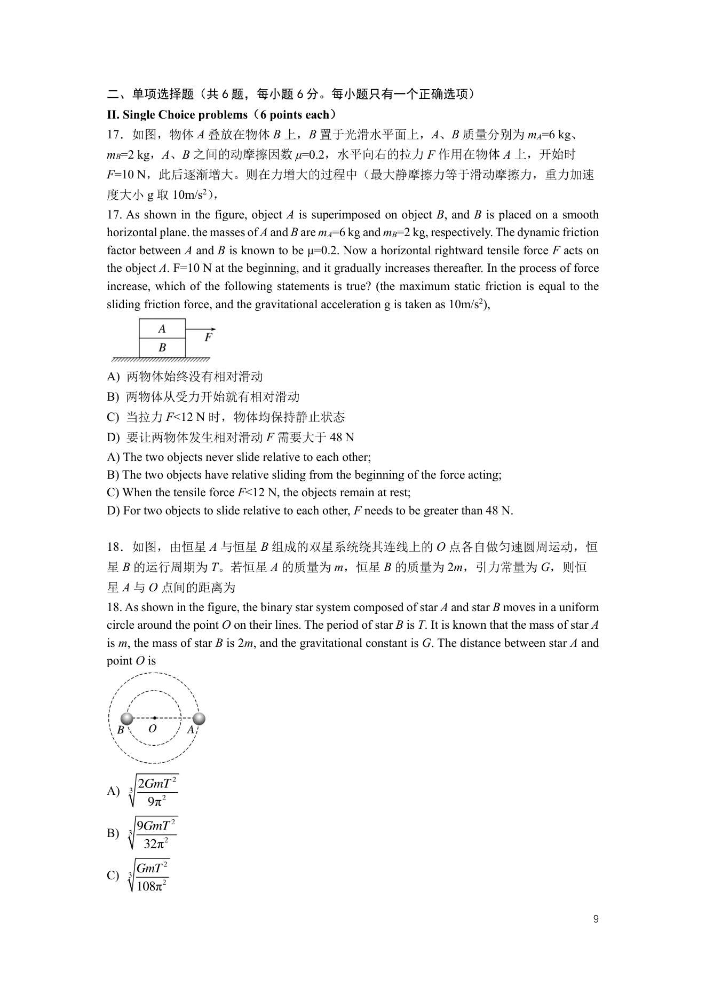

第 9 页可检索文本

<pre>
二、单项选择题（共 6 题，每小题 6 分。每小题只有一个正确选项）
II. Single Choice problems（6 points each）
17．如图，物体 A 叠放在物体 B 上，B 置于光滑水平面上，A、B 质量分别为 mA=6 kg、
mB=2 kg，A、B 之间的动摩擦因数 μ=0.2，水平向右的拉力 F 作用在物体 A 上，开始时
F=10 N，此后逐渐增大。则在力增大的过程中（最大静摩擦力等于滑动摩擦力，重力加速
度大小 g 取 10m/s2），
17. As shown in the figure, object A is superimposed on object B, and B is placed on a smooth
horizontal plane. the masses of A and B are mA=6 kg and mB=2 kg, respectively. The dynamic friction
factor between A and B is known to be μ=0.2. Now a horizontal rightward tensile force F acts on
the object A. F=10 N at the beginning, and it gradually increases thereafter. In the process of force
increase, which of the following statements is true? (the maximum static friction is equal to the
sliding friction force, and the gravitational acceleration g is taken as 10m/s2),

A) 两物体始终没有相对滑动
B) 两物体从受力开始就有相对滑动
C) 当拉力 F&lt;12 N 时，物体均保持静止状态
D) 要让两物体发生相对滑动 F 需要大于 48 N
A) The two objects never slide relative to each other;
B) The two objects have relative sliding from the beginning of the force acting;
C) When the tensile force F&lt;12 N, the objects remain at rest;
D) For two objects to slide relative to each other, F needs to be greater than 48 N.

18．如图，由恒星 A 与恒星 B 组成的双星系统绕其连线上的 O 点各自做匀速圆周运动，恒
星 B 的运行周期为 T。若恒星 A 的质量为 m，恒星 B 的质量为 2m，引力常量为 G，则恒
星 A 与 O 点间的距离为
18. As shown in the figure, the binary star system composed of star A and star B moves in a uniform
circle around the point O on their lines. The period of star B is T. It is known that the mass of star A
is m, the mass of star B is 2m, and the gravitational constant is G. The distance between star A and
point O is

         2GmT 2
A)   3
          9π 2
         9GmT 2
B)   3
          32π 2
         GmT 2
C)   3
         108π2

                                                                                                      9
</pre>

---

## 第 10 页

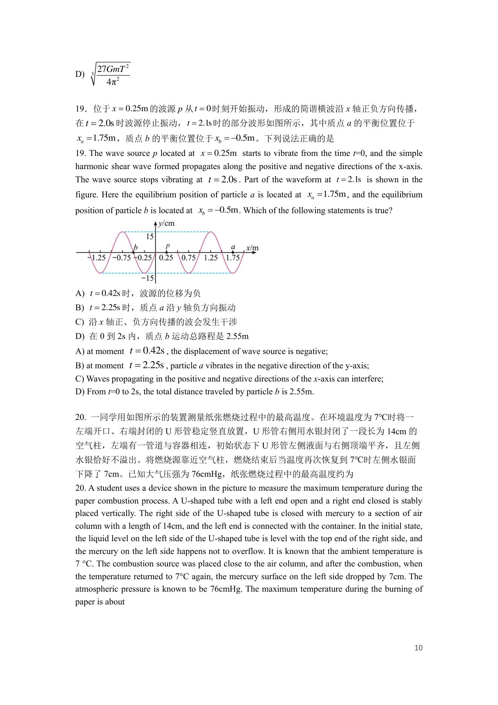

第 10 页可检索文本

<pre>
         27GmT 2
D)   3
           4π 2

19．位于 x = 0.25m 的波源 p 从 t = 0 时刻开始振动，形成的简谐横波沿 x 轴正负方向传播，
在 t = 2.0s 时波源停止振动， t = 2.1s 时的部分波形如图所示，其中质点 a 的平衡位置位于
xa = 1.75m ，质点 b 的平衡位置位于 xb = −0.5m 。下列说法正确的是
19. The wave source p located at x = 0.25m starts to vibrate from the time t=0, and the simple
harmonic shear wave formed propagates along the positive and negative directions of the x-axis.
The wave source stops vibrating at t = 2.0s . Part of the waveform at t = 2.1s is shown in the
figure. Here the equilibrium position of particle a is located at xa = 1.75m , and the equilibrium
position of particle b is located at xb = −0.5m . Which of the following statements is true?

A) t = 0.42s 时，波源的位移为负
B) t = 2.25s 时，质点 a 沿 y 轴负方向振动
C) 沿 x 轴正、负方向传播的波会发生干涉
D) 在 0 到 2s 内，质点 b 运动总路程是 2.55m
A) at moment t = 0.42s , the displacement of wave source is negative;
B) at moment t = 2.25s , particle a vibrates in the negative direction of the y-axis;
C) Waves propagating in the positive and negative directions of the x-axis can interfere;
D) From t=0 to 2s, the total distance traveled by particle b is 2.55m.

20. 一同学用如图所示的装置测量纸张燃烧过程中的最高温度。在环境温度为 7℃时将一
左端开口、右端封闭的 U 形管稳定竖直放置，U 形管右侧用水银封闭了一段长为 14cm 的
空气柱，左端有一管道与容器相连，初始状态下 U 形管左侧液面与右侧顶端平齐，且左侧
水银恰好不溢出。将燃烧源靠近空气柱，燃烧结束后当温度再次恢复到 7℃时左侧水银面
下降了 7cm。已知大气压强为 76cmHg，纸张燃烧过程中的最高温度约为
20. A student uses a device shown in the picture to measure the maximum temperature during the
paper combustion process. A U-shaped tube with a left end open and a right end closed is stably
placed vertically. The right side of the U-shaped tube is closed with mercury to a section of air
column with a length of 14cm, and the left end is connected with the container. In the initial state,
the liquid level on the left side of the U-shaped tube is level with the top end of the right side, and
the mercury on the left side happens not to overflow. It is known that the ambient temperature is
7 °C. The combustion source was placed close to the air column, and after the combustion, when
the temperature returned to 7°C again, the mercury surface on the left side dropped by 7cm. The
atmospheric pressure is known to be 76cmHg. The maximum temperature during the burning of
paper is about

                                                                                                    10
</pre>

---

## 第 11 页

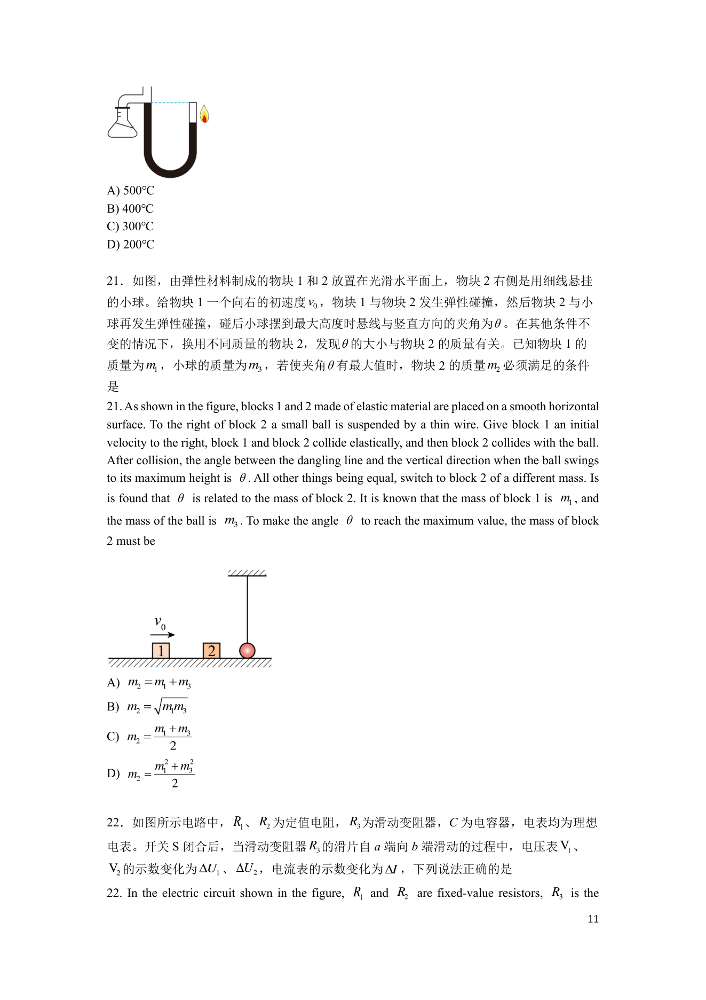

第 11 页可检索文本

<pre>
A) 500℃
B) 400℃
C) 300℃
D) 200℃

21．如图，由弹性材料制成的物块 1 和 2 放置在光滑水平面上，物块 2 右侧是用细线悬挂
的小球。给物块 1 一个向右的初速度 v0 ，物块 1 与物块 2 发生弹性碰撞，然后物块 2 与小
球再发生弹性碰撞，碰后小球摆到最大高度时悬线与竖直方向的夹角为  。在其他条件不
变的情况下，换用不同质量的物块 2，发现  的大小与物块 2 的质量有关。已知物块 1 的
质量为 m1 ，小球的质量为 m3 ，若使夹角  有最大值时，物块 2 的质量 m2 必须满足的条件
是
21. As shown in the figure, blocks 1 and 2 made of elastic material are placed on a smooth horizontal
surface. To the right of block 2 a small ball is suspended by a thin wire. Give block 1 an initial
velocity to the right, block 1 and block 2 collide elastically, and then block 2 collides with the ball.
After collision, the angle between the dangling line and the vertical direction when the ball swings
to its maximum height is  . All other things being equal, switch to block 2 of a different mass. Is
is found that  is related to the mass of block 2. It is known that the mass of block 1 is m1 , and
the mass of the ball is m3 . To make the angle  to reach the maximum value, the mass of block
2 must be

A) m2 = m1 + m3
B) m2 = m1m3
          m1 + m3
C) m2 =
             2
          m12 + m32
D) m2 =
              2

22．如图所示电路中， R1 、 R2 为定值电阻， R3 为滑动变阻器，C 为电容器，电表均为理想
电表。开关 S 闭合后，当滑动变阻器 R3 的滑片自 a 端向 b 端滑动的过程中，电压表 V1 、
V2 的示数变化为 U1 、 U 2 ，电流表的示数变化为 I ，下列说法正确的是
22. In the electric circuit shown in the figure, R1 and R2 are fixed-value resistors, R3 is the

                                                                                                     11
</pre>

---

## 第 12 页

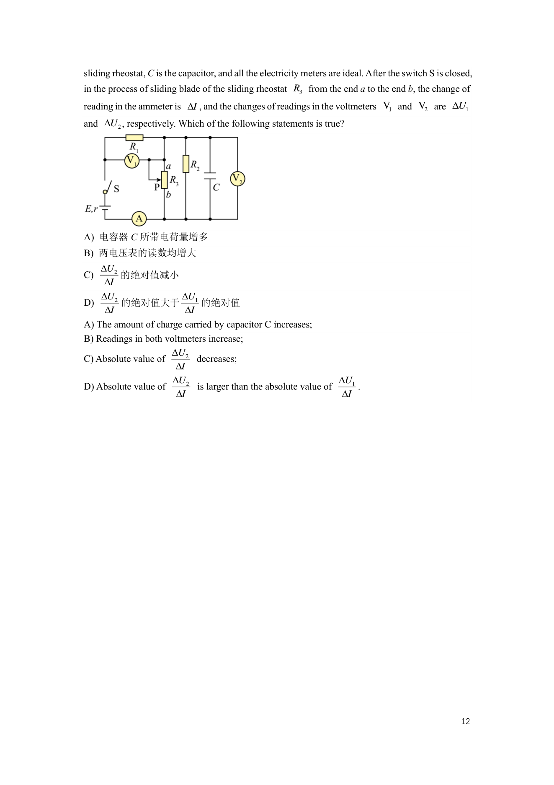

第 12 页可检索文本

<pre>
sliding rheostat, C is the capacitor, and all the electricity meters are ideal. After the switch S is closed,
in the process of sliding blade of the sliding rheostat R3 from the end a to the end b, the change of
reading in the ammeter is I , and the changes of readings in the voltmeters V1 and V2 are U1
and U 2 , respectively. Which of the following statements is true?

A) 电容器 C 所带电荷量增多
B) 两电压表的读数均增大
    U2
C)      的绝对值减小
     I
    U2                 U1
D)      的绝对值大于                的绝对值
     I                   I
A) The amount of charge carried by capacitor C increases;
B) Readings in both voltmeters increase;
                     U2
C) Absolute value of         decreases;
                       I
                      U2                                         U1
D) Absolute value of         is larger than the absolute value of     .
                       I                                          I

                                                                                                         12
</pre>

---

## 第 13 页

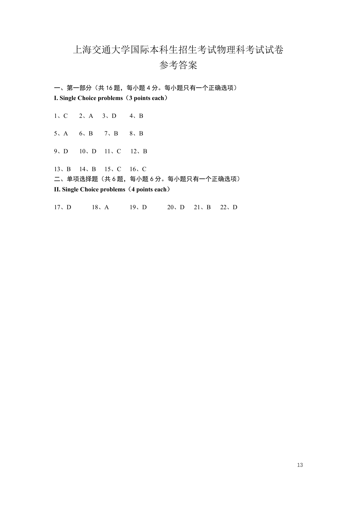

第 13 页可检索文本

<pre>
       上海交通大学国际本科生招生考试物理科考试试卷
                                    参考答案

一、第一部分（共 16 题，每小题 4 分。每小题只有一个正确选项）
I. Single Choice problems（3 points each）

1、C     2、A     3、D       4、B

5、A     6、B      7、B      8、B

9、D     10、D     11、C     12、B

13、B    14、B     15、C     16、C
二、单项选择题（共 6 题，每小题 6 分。每小题只有一个正确选项）
II. Single Choice problems（4 points each）

17、D         18、A         19、D         20、D   21、B   22、D

                                                            13
</pre>

---
